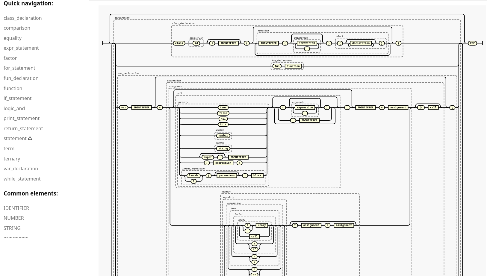

# Gustav [^1]

<picture>
  <source media="(prefers-color-scheme: dark)" srcset="./assets/logo_dark.svg">
  <source media="(prefers-color-scheme: light)" srcset="./assets/logo_light.svg">
  
</picture>


<p align="center"><i>Too heavy for its own good.</i></p>

<p align="center">
<a href="https://github.com/AbduazizZiyodov/gustav/actions/workflows/ci.yml">
  
</a>
<a href="https://codecov.io/github/AbduazizZiyodov/gustav" > 
  
 </a>
</p>

## About

Tree-Walk Interpreter implemented in pure(_modern btw_) CPython for experimenting/learning purposes. Based on amazing book [Crafting Interpreters](https://craftinginterpreters.com) by _Bob Nystrom_ (its cpython implementation of _Lox_).

Interpreter consists of basic components as mentioned in the book: `Scanner => Parser => Resolver => Interpreter`.

Manual/hand-written basic single-pass scanner(a.k.a lexer). Then we have classic top-down, recursive descent parser (`LL(1)` btw). Resolver is used for semantic analysis which "mostly" performs lexical scope resolution before interpretation. So there is no type checking, hoisting or any other fancy features, just lexical scope analyzer. Then, we can see tree-walk interpreter which wires all these components, uses visitor pattern and evaluates AST nodes directly.

## Future Work

Implementing "Bytecode Virtual Machine" variation in separate branch.

## Grammar

Grammar definitions are written using [Wirth Syntax Notation](https://en.wikipedia.org/wiki/Wirth_syntax_notation) instead of the more common `BNF`/`EBNF`. For this project, Wirth notation has no significant drawbacks and is fully compatible with the syntax diagram tool that I saw (see below).

> [!TIP]
> You can paste the grammar into [this site](https://matthijsgroen.github.io/ebnf2railroad/try-yourself.html) to view and explore it as interactive syntax diagrams.
> 

<details>
<summary>See grammar</summary>

```ebnf
program = { declaration } , "EOF" ;

declaration
  = class_declaration
  | fun_declaration
  | var_declaration
  | statement
  ;

class_declaration = "class" , IDENTIFIER ,
  [ "<" , IDENTIFIER ] , "{" , { function } , "}" ;

fun_declaration = "fun" , function ;

var_declaration = "var" , IDENTIFIER , [ "=" ,
  expression ] , ";" ;

statement
  = expr_statement   | for_statement
  | if_statement     | print_statement
  | return_statement | while_statement
  | loop_statement   | block
  | break_statement  | continue_statement
  ;

expr_statement = expression , ";" ;

for_statement = "for" , "(" , ( var_declaration | expr_statement | ";" ) ,
  [ expression ] , ";" , [ expression ] , ")" ,
  statement ;

if_statement = "if" , "(" , expression , ")" ,
  statement , [ "else" , statement ] ;

print_statement = "print" , expression , ";" ;

return_statement = "return" , [ expression ] , ";" ;

while_statement = "while" , "(" , expression , ")" ,
  statement ;

loop_statement = "loop" , statement ;

block = "{" , { declaration } , "}" ;

break_statement = "break" , ";" ;

continue_statement = "continue" , ";" ;

expression = assignment ;

assignment
  = ( call , "." , IDENTIFIER , "=" , assignment )
  | logic_or
  ;

logic_or = logic_and , { "or" , logic_and } ;

logic_and = equality , { "and" , equality } ;

equality = comparison , { ( "!=" | "==" ) , comparison } ;

comparison = term , { ( ">" | ">=" | "<" | "<=" ) , term } ;

term = factor , { ( "-" | "+" | "++" | "^" ) , factor } ;

factor = unary , { ( "/" | "*" ) , unary } ;

unary = ( "!" | "-" ) , unary | call ;

call = primary , {
  ( "(" , [ arguments ] , ")"
  | "." , IDENTIFIER
  ) } , { "|>" , call } ;

primary
  = "true"                     | "false"
  | "nil"                      | "this"
  | NUMBER                     | STRING
  | IDENTIFIER                 | "(" , expression , ")"
  | "super" , "." , IDENTIFIER | lambda_expression
  ;

ternary = equality , [ "?" , assignment , ":" ,
  assignment ] ;

lambda_expression = ( "lambda" | "λ" ) , "(" ,
  [ parameters ] , ")" , block ;

function = IDENTIFIER , "(" , [ parameters ] , ")" , block ;

parameters = IDENTIFIER , { "," , IDENTIFIER } ;

arguments = expression , { "," , expression } ;

NUMBER = "number" ;

STRING = "string" ;

IDENTIFIER = "id" ;
```

</details>

## "Features" & User Guide

Its dynamically typed, it has booleans, numbers, strings & nil data types.

Basic arithmetic expressions

```
add + me;
subtract - me;
multiply * me;
divide / me;
-negateMe;
```

Ternary expressions(added by me)

```
condition ? thenArm : elseArm;
```

Comparision & equality

```
less < than;
lessThan <= orEqual;
greater > than;
greaterThan >= orEqual;

1 == 2;         // false.
"cat" != "dog"; // true.

314 == "pi"; // false.
```

Logical operators

```
!true;  // false.
!false; // true.

true and false; // false.
true and true;  // true.

false or false; // false.
true or false;  // true.
```

Print statement

```
print "Gustav";

{
  print "Gustav from block";
}
```

Variables

```
var imAVariable = "here is my value";
var iAmNil;
```

Control flow

```
if (condition) {
  print "yes";
} else {
  print "no";
}
```

```
var a = 1;
while (a < 10) {
  print a;
  a = a + 1;
}
```

```
for (var a = 1; a < 10; a = a + 1) {
  print a;
}
```

```
loop { // same as `while (true)`
  print "Gustav!";
}
```

Functions

```
fun printSum(a, b) {
  print a + b;
}
```

```

var make_adder = λ(x) {
  return λ(y) { return x + y; };
};

var add_two = make_adder(2);
print add_two(3); // 5
print make_adder(10)(1); // 11
```

Closures

```
fun addPair(a, b) {
  return a + b;
}

fun identity(a) {
  return a;
}

print identity(addPair)(1, 2); // Prints "3".
```

Classes

```
class Breakfast {
  cook() {
    print "Eggs a-fryin'!";
  }

  serve(who) {
    print "Enjoy your breakfast, " + who + ".";
  }
}

// Store it in variables.
var someVariable = Breakfast;

// Pass it to functions.
someFunction(Breakfast);

```

```
class Breakfast {
  init(meat, bread) {
    this.meat = meat;
    this.bread = bread;
  }

  // ...
}

var baconAndToast = Breakfast("bacon", "toast");
baconAndToast.serve("Dear Reader");
// "Enjoy your bacon and toast, Dear Reader."
```

```
class Brunch < Breakfast {
  drink() {
    print "How about a Bloody Mary?";
  }
}
```

```
class Brunch < Breakfast {
  init(meat, bread, drink) {
    super.init(meat, bread);
    this.drink = drink;
  }
}
```

Builtin functions

```
print clock();
var name = input("Enter your name> ");
sleep(5)
```

## Running

Python version over `3.13` is recommended. Clone this repository, if you have `uv` run `uv sync` or use your system's "python".

```shell
<python> -m gustav <file>
```

You can enable debug flag by setting `DEBUG=yes` as environment variable (it will show entire process, ast nodes, and some debug logs during runtime).

if you don't provide file as argument you will get `REPL` prompt. Which I see as "useless", because there is no support for statement/expressions. I wanted to implement this via `curses` library, I though its not worth, instead I'll explore other concepts.

## Development

Requirements

- `uv` - https://docs.astral.sh/uv
- `just` - https://just.systems/man/en

```shell
uv sync --dev
uv run pre-commit install
```

Make your changes. If you want to update/extend AST nodes, edit `tools/ast_generator/definitions.py`(format is simple) then run

```
just generate_ast
```

which will generate AST files in `gustav/ast.

Run checks (formatting, linting & type-checking):

```shell
just check
```

Test with coverage check:

```shell
just test
# or
just test-no-cover
```

[^1]: The name _Gustav_ is inspired by the [Schwerer Gustav](https://en.wikipedia.org/wiki/Schwerer_Gustav), a massive German railway gun built during WW2. The intention is not to glorify(romanticize) war or any political ideology - especially not **Nazism** - but to appreciate the engineering behind it. Current implementation (in cpython) is heavy as this railway gun.
